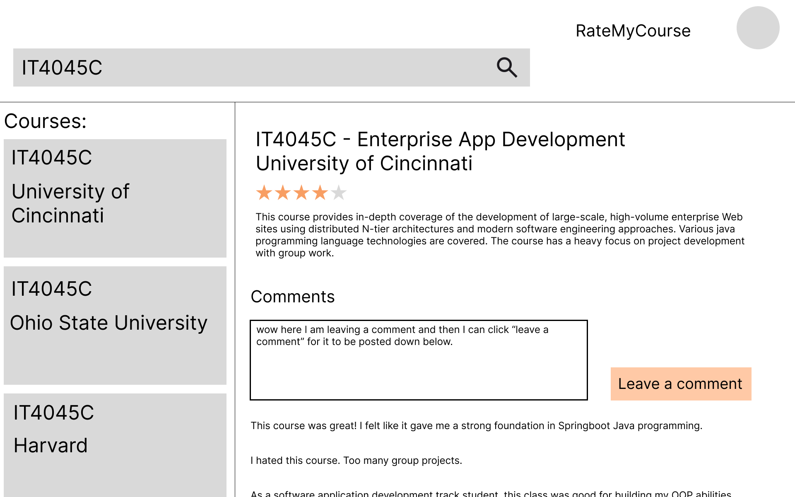
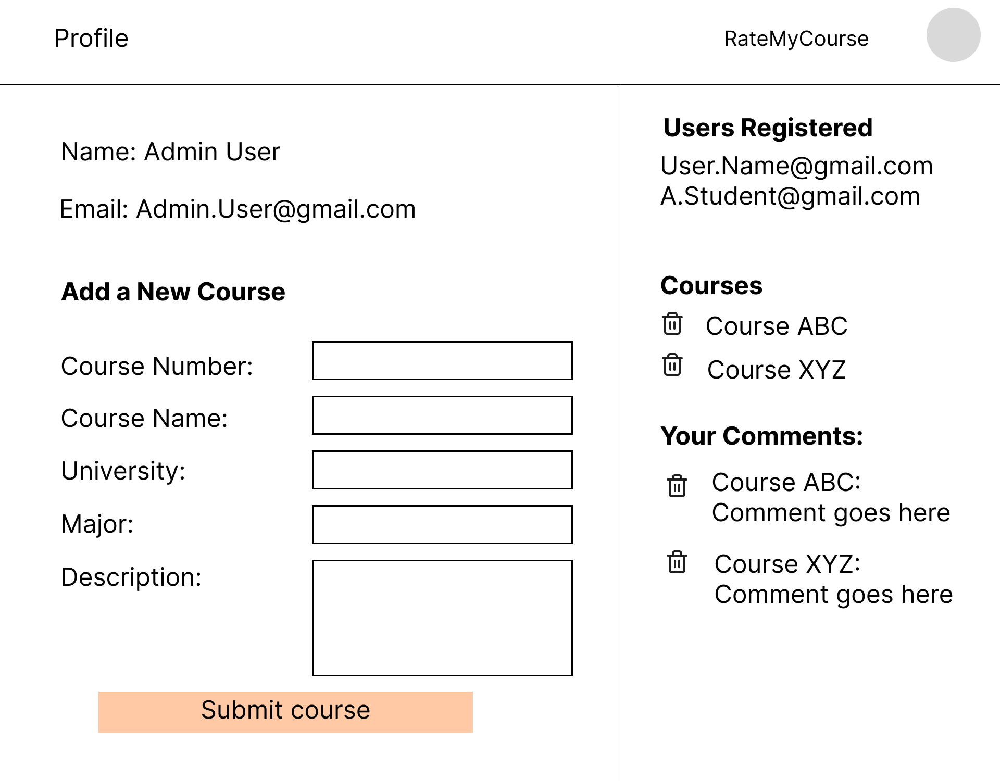
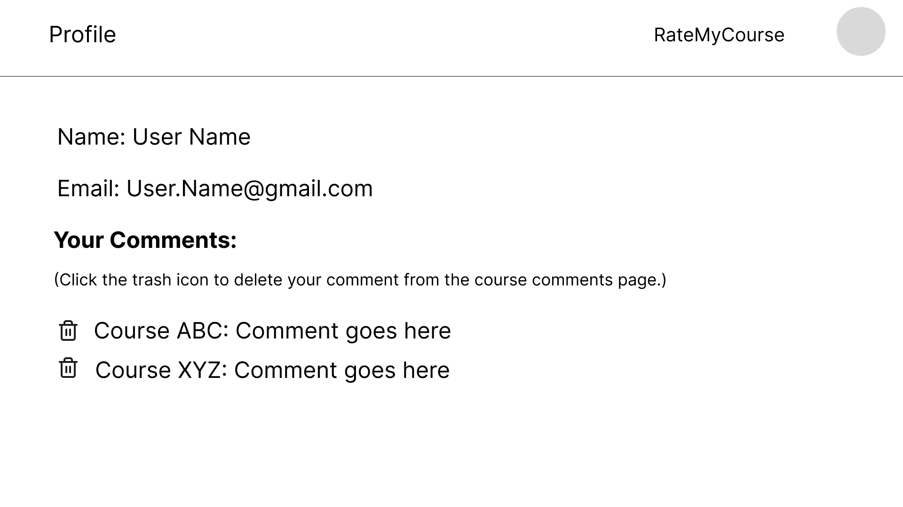
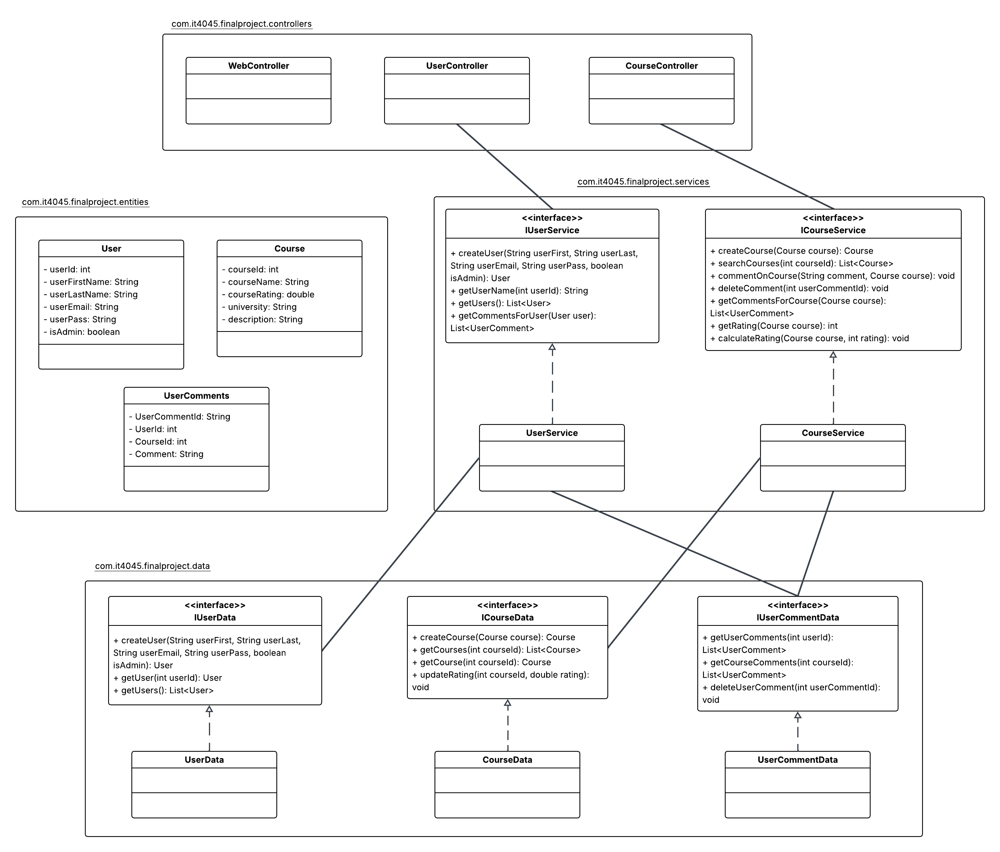

# RateMyCourse

### Team Members: 
- Jason Welsh
- Sage Bushstone
- Ella Seibert
- Ethan Goudy

### Project Overview:
University students want to go into new experiences feeling prepared. Currently, there is not an easily accessible way for college students to view ratings for a course. Rate My Professor allows students to see what prior students have said about the course, such as technologies used, example syllabi, how other students thought it related to their majors, etc. As such, we want to develop RateMyCourse to give students an easy way to collect infomration about their courses prior to their semester starting. 

### Goals and Objectives
- To allow students to provide ratings and feedback for courses.
- To provide a searchable catalog of university courses based on course number (i.e. IT4045C).
- To enable students to see comments from previous students about a course.

### Functional Requirements

#### Scenario: Log In
- Given a person is on the login page
- When the user enters a preexisting email and password
- Then they are authenticated and redirected to the website
#### Scenario: Create User
- Given a non-registered user is on the login page
- When they click sign up with their email/password entered
- Then they are added to the database and redirected to the website
#### Scenario: User searches for an existing course
- Given a user is on the home page
- When user searches in the search bar with a course number
- Then a list of possible matches is returned
#### Scenario: User comments on a course
- Given a user has searched and found a course
- When a user types in a comment and clicks "comment"
- Then the comment is posted to the page and to the database
#### Scenario: Create university courses
- Given a user is an admin and is on the profile page
- When the admin fills out the form and clicks "create course"
- Then the course is added to the database and can appear in the search

### StoryBoard
1. This will be the home page that the user will see. They will need to log in to view the courses. They can also sign up to create a new user. 

2. Once logged in, the user will see a screen where they can search for classes. The default page(no search) will prompt them to search.

3. Once they search, some course results will pop up, and they can see details about the course as well as previous comments by other students. The user can input a comment on their own about the course as well as provide a rating. 

4. If the course number searched doesn't return any results, this is what the user will see.

5. The admin user can then go into the admin profile page to create a course that doesn't exist yet. The admin panel also has other details like courses registered and users registered.

6. The user can also click into their profile to see their details and any comments they've made previously, as well as deleting those comments. 

### Class Diagram

[Link to original LucidChart Class Diagram](https://lucid.app/lucidchart/da452509-1147-4ec6-976c-e8bc58310a99/edit?viewport_loc=-198%2C-652%2C5115%2C2260%2C0_0&invitationId=inv_c39cdfe5-c0b1-4025-80d1-99e03c792445)

#### com.it4045.finalproject.controllers
HomeController: routes the starting webpage
UserController: endpoint for interacting with courses
CourseController: endpoint for interacting with users
CommentController: endpoint for interacting with comments
AuthController: endpoint for authenticating users (i.e. logging in)

#### com.it4045.finalproject.entities
All entities will use Lombok for getters and setters and other boilerplate methods so they have been excluded from the diagram and description.
User: stores information for the users. Field "role" can either be "User" or "Admin"; this determines the profile page that the user is able to see.
Course: stores information for the courses
UserComments: acts as a crossreference table for User and Course.

#### com.it4045.finalproject.services
UserService: implements IUserService
IUserService: interface for user logic. All methods are signature only as is the case for interfaces. Implemented by UserService:
- createUser(): creating a user on signup
- getUserName(): getting the user name
- getUsers(): getting a list of users (for the admin page)
- getCommentsForUser(): getting all the comments a user has made (for the profile page)
- getUser(): get a user by ID
- deleteComment(): deletes comment for a user
- login(): logs a user in and returns the DTO
- signUp(): registers a user with RateMyCourse
- findByEmail(): finds a user by email for authentication purposes

CourseService: implements ICourseService
ICourseService: interface for course logic. All methods are signature only as is the case for interfaces. 
Implemented by CourseService.
- createCourse(): creating a course
- searchCourses(): gets a course based on the course number
- getCourses(): gets all courses
- getCourseById(): gets one course by an ID
- commentOnCourse(): creates a comment based on user input
- calculateRating(): calculates the new rating based on user input for rating
- deleteCourse(): deletes a course by ID

#### com.it4045.finalproject.data
Each repository implements JPARepository, providing a set of base operations against the database.
UserRepository: implements JPARepository
- findByEmail(): gets a user from the database by email

CourseRepository: implements JPARepository
- findByUniversityAndCourseName(): finds a course by university and course name to check for duplication
- findByUniversityAndCourseNumber(): finds a course by university and course number to check for duplication
- findByCourseNumber(): finds a course by the number (i.e. IT4045C)

UserCommentRepository: implements JPARepository
- findByUser(): finds a user from the database by User entity

### Architecture and Components of Application

### Roles
- Jason Welsh
    - Scrum Master and Backend Developer
- Sage Bushstone
    - Product Owner and Backend Developer
- Ella Seibert
    - DevOps - FrontEnd Developer
- Ethan Goudy
    - DevOps - BackEnd Developer

### Github Project and Repo Link
- [Github Project](https://github.com/users/urboi11/projects/4)
- [Github Repo](https://github.com/urboi11/IT4045-Final-Project)

### Project Set-up
To set up the project, you will need to ensure you have system environment variables created to connect to the database. If you want to, you can change the name of the database to better match your environment.
 - MYSQL_PASSWORD: your password to the MYSQL root account
 - MYSQL_URL: jdbc:mysql://localhost:3306/finalproject?createDatabaseIfNotExist = true
 - MYSQL_USERNAME: root, or the username for your MYSQL account

### Code Review
Here is a video explaining some of the endpoints we have covered in our project. 
- [Youtube Video](https://www.youtube.com/watch?v=2laoNpcKkO8)

