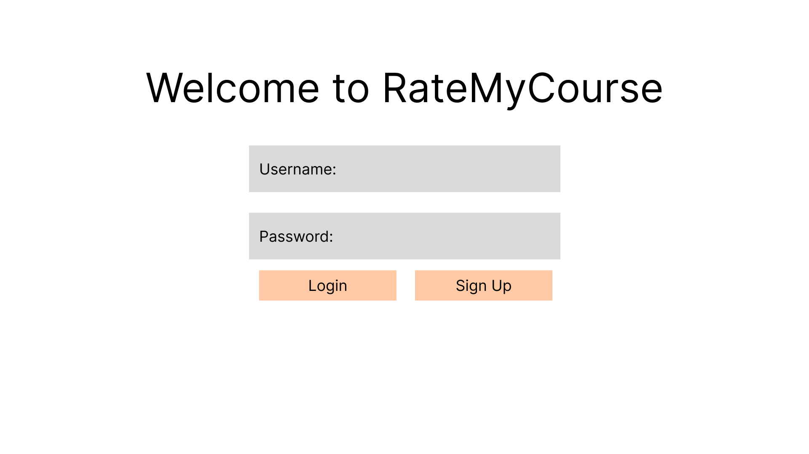
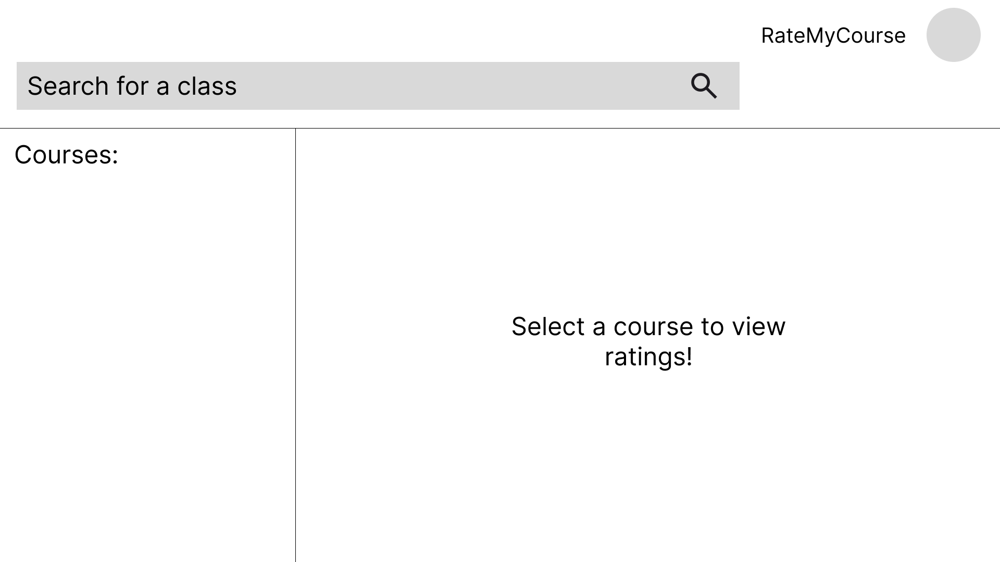

# RateMyCourse

### Team Members: 
- Jason Welsh
- Sage Bushstone
- Ella Seibert
- Ethan Goudy

### Project Overview:
University students want to go into new experiences feeling prepared. Currently, there is not an easily accessible way fo college students to view ratings for a course. Rate My Professor allows students to see what prior students have said about the course, such as technologies used, example syllabi, how other students thought it related to their majors, etc. As such, we want to develop RateMyCourse to give students an easy way to collect infomration about their courses prior to thei semester starting. 

### Goals and Objectives
- To allow students to provide ratings and feedback for courses.
- To provide a searchable catalog of unviersity courses base on course ID.
- To enable students to see comments from previous students about a course.

### Functional Requirements

#### Scenario: Log In
- Given a person is on the login page
- When the user enters a preexisting email and password
- Then they are authenticated and redirected to the website
#### Scenario: Create User
- Given a non-registered user is on the login page
- When they click sign up with their email/password entered
- Then they are added to the database and redirected to the website
#### Scenario: User searches for an existing course
- Given a user is on the home page
- When user searches in the search bar with a course id
- Then a list of possible matches is returned
#### Scenario: User comments on a course
- Given a user has searched and found a course
- When a user types in a comment and clicks "comment"
- Then the comment is posted to the page and to the database
#### Scenario: Create university courses
- Given a user is an admin and is on the profile page
- When the admin fills out the form and clicks "create course"
- Then the course is added to the database and can appear in the search

### StoryBoard
1. This will be the home page that the user will see. They will need to log in to view the courses. They can also sign up to create a new user. 

2. Once logged in, the user will see a screen where they can search for classes. The default page(no search) will prompt them to search.

3. Once they serach, some course results will pop up and they can see details about the course as well as previous comments by other students. The user can input a comment on their own about the course as well as provide a rating. 

4. If the course number searched doesn't return any results, this is what the user will see.

5. The admin user can then go intot he admin profile page to craeate a crouse that doesn't exist yet. The admin panel also has other details like courses registered and users registered.
